# Mermaid Flowchart Syntax - Complete Reference

**Source:** Official Mermaid Documentation - https://mermaid.js.org/syntax/flowchart.html

---

## Overview

Flowcharts are composed of **nodes** (geometric shapes) and **edges** (arrows or lines). The Mermaid code defines how nodes and edges are made and accommodates different arrow types, multi-directional arrows, and any linking to and from subgraphs.

### Important Warnings

⚠️ **"end" keyword**: If you are using the word "end" in a Flowchart node, capitalize the entire word or any of the letters (e.g., "End" or "END"), or apply the [workaround](https://github.com/mermaid-js/mermaid/issues/1444#issuecomment-639528897). Typing "end" in all lowercase letters will break the Flowchart.

⚠️ **"o" or "x" prefix**: If you are using the letter "o" or "x" as the first letter in a connecting Flowchart node, add a space before the letter or capitalize the letter (e.g., "dev--- ops", "dev---Ops").
- Typing "A---oB" will create a circle edge
- Typing "A---xB" will create a cross edge

---

## Basic Syntax

### Node Declarations

#### A Node (Default)

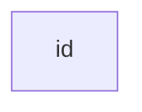

The `id` is what is displayed in the box.

💡 **TIP**: Instead of `flowchart` one can also use `graph`.

#### A Node with Text

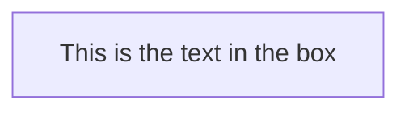

It is possible to set text in the box that differs from the id. If this is done several times, it is the last text found for the node that will be used. Also if you define edges for the node later on, you can omit text definitions. The one previously defined will be used when rendering the box.

#### Unicode Text

Use `"` to enclose the unicode text.

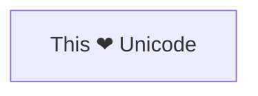

#### Markdown Formatting

Use double quotes and backticks `` "` text `" `` to enclose the markdown text.

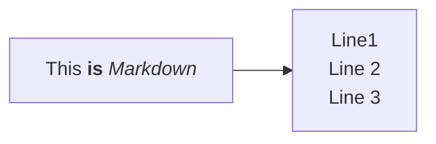

---

## Direction

This statement declares the direction of the Flowchart.

### Top to Bottom (TD or TB)

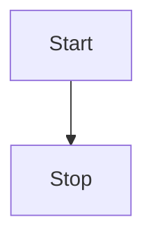

### Left to Right (LR)

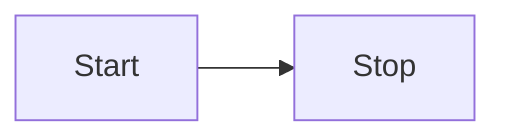

### Possible Flowchart Orientations

- **TB** - Top to bottom
- **TD** - Top-down / same as top to bottom
- **BT** - Bottom to top
- **RL** - Right to left
- **LR** - Left to right

---

## Node Shapes

### Basic Node Shapes

#### Round Edges

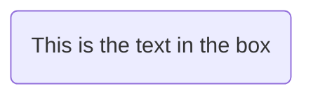

#### Stadium-Shaped Node

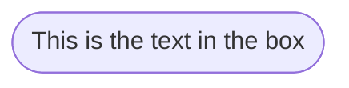

#### Subroutine Shape

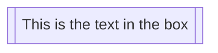

#### Cylindrical Shape (Database)

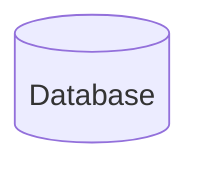

#### Circle

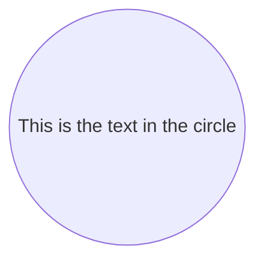

#### Asymmetric Shape

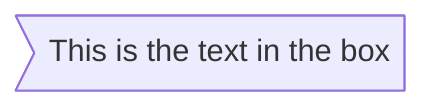

⚠️ Currently only the shape above is possible and not its mirror. This might change with future releases.

#### Rhombus (Diamond)

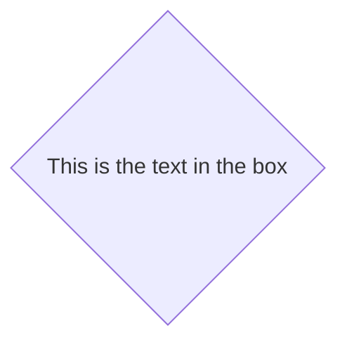

#### Hexagon

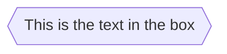

#### Parallelogram

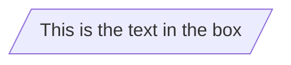

#### Parallelogram Alt

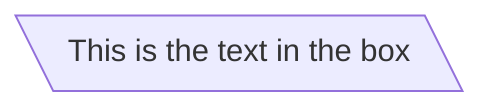

#### Trapezoid

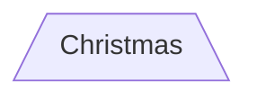

#### Trapezoid Alt

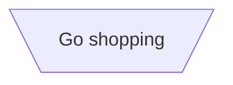

#### Double Circle

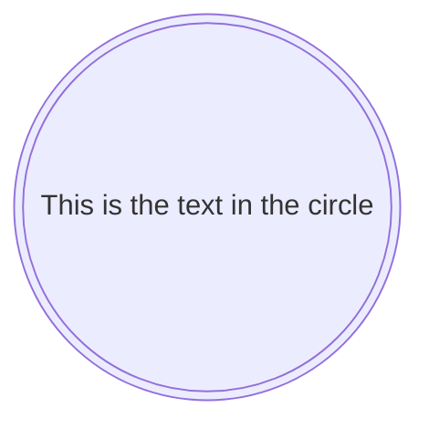

---

## Expanded Node Shapes (v11.3.0+)

Mermaid introduces **30 new shapes** to enhance the flexibility and precision of flowchart creation. These new shapes provide more options to represent processes, decisions, events, data storage visually, and other elements within your flowcharts.

### New Syntax for Shape Definition

Mermaid now supports a general syntax for defining shape types:

```mermaid
A@{ shape: rect }
```

This syntax creates a node A as a rectangle. It renders the same way as `A["A"]` or `A`.

### Complete List of New Shapes

| Visual Name | Description | Short Name | Semantic Meaning | Aliases |
|-------------|-------------|------------|------------------|---------|
| Bang | Bang | bang | Bang | bang |
| Card | Notched Rectangle | notch-rect | Represents a card | card, notched-rectangle |
| Cloud | Cloud | cloud | cloud | cloud |
| Collate | Hourglass | hourglass | Represents a collate operation | collate, hourglass |
| Com Link | Lightning Bolt | bolt | Communication link | com-link, lightning-bolt |
| Comment | Curly Brace | brace | Adds a comment | brace-l, comment |
| Comment Right | Curly Brace | brace-r | Adds a comment | |
| Comment with braces on both sides | Curly Braces | braces | Adds a comment | |
| Data Input/Output | Lean Right | lean-r | Represents input or output | in-out, lean-right |
| Data Input/Output | Lean Left | lean-l | Represents output or input | lean-left, out-in |
| Database | Cylinder | cyl | Database storage | cylinder, database, db |
| Decision | Diamond | diam | Decision-making step | decision, diamond, question |
| Delay | Half-Rounded Rectangle | delay | Represents a delay | half-rounded-rectangle |
| Direct Access Storage | Horizontal Cylinder | h-cyl | Direct access storage | das, horizontal-cylinder |
| Disk Storage | Lined Cylinder | lin-cyl | Disk storage | disk, lined-cylinder |
| Display | Curved Trapezoid | curv-trap | Represents a display | curved-trapezoid, display |
| Divided Process | Divided Rectangle | div-rect | Divided process shape | div-proc, divided-process, divided-rectangle |
| Document | Document | doc | Represents a document | doc, document |
| Event | Rounded Rectangle | rounded | Represents an event | event |
| Extract | Triangle | tri | Extraction process | extract, triangle |
| Fork/Join | Filled Rectangle | fork | Fork or join in process flow | join |
| Internal Storage | Window Pane | win-pane | Internal storage | internal-storage, window-pane |
| Junction | Filled Circle | f-circ | Junction point | filled-circle, junction |
| Lined Document | Lined Document | lin-doc | Lined document | lined-document |
| Lined/Shaded Process | Lined Rectangle | lin-rect | Lined process shape | lin-proc, lined-process, lined-rectangle, shaded-process |
| Loop Limit | Trapezoidal Pentagon | notch-pent | Loop limit step | loop-limit, notched-pentagon |
| Manual File | Flipped Triangle | flip-tri | Manual file operation | flipped-triangle, manual-file |
| Manual Input | Sloped Rectangle | sl-rect | Manual input step | manual-input, sloped-rectangle |
| Manual Operation | Trapezoid Base Top | trap-t | Represents a manual task | inv-trapezoid, manual, trapezoid-top |
| Multi-Document | Stacked Document | docs | Multiple documents | documents, st-doc, stacked-document |
| Multi-Process | Stacked Rectangle | st-rect | Multiple processes | processes, procs, stacked-rectangle |
| Odd | Odd | odd | Odd shape | |
| Paper Tape | Flag | flag | Paper tape | paper-tape |
| Prepare Conditional | Hexagon | hex | Preparation or condition step | hexagon, prepare |
| Priority Action | Trapezoid Base Bottom | trap-b | Priority action | priority, trapezoid, trapezoid-bottom |
| Process | Rectangle | rect | Standard process shape | proc, process, rectangle |
| Start | Circle | circle | Starting point | circ |
| Start | Small Circle | sm-circ | Small starting point | small-circle, start |
| Stop | Double Circle | dbl-circ | Represents a stop point | double-circle |
| Stop | Framed Circle | fr-circ | Stop point | framed-circle, stop |
| Stored Data | Bow Tie Rectangle | bow-rect | Stored data | bow-tie-rectangle, stored-data |
| Subprocess | Framed Rectangle | fr-rect | Subprocess | framed-rectangle, subproc, subprocess, subroutine |
| Summary | Crossed Circle | cross-circ | Summary | crossed-circle, summary |
| Tagged Document | Tagged Document | tag-doc | Tagged document | tag-doc, tagged-document |
| Tagged Process | Tagged Rectangle | tag-rect | Tagged process | tag-proc, tagged-process, tagged-rectangle |
| Terminal Point | Stadium | stadium | Terminal point | pill, terminal |
| Text Block | Text Block | text | Text block | |

### Examples with New Shapes

#### Process
```mermaid
flowchart TD
    A@{ shape: rect, label: "This is a process" }
```

#### Event
```mermaid
flowchart TD
    A@{ shape: rounded, label: "This is an event" }
```

#### Terminal Point (Stadium)
```mermaid
flowchart TD
    A@{ shape: stadium, label: "Terminal point" }
```

#### Subprocess
```mermaid
flowchart TD
    A@{ shape: subproc, label: "This is a subprocess" }
```

#### Database (Cylinder)
```mermaid
flowchart TD
    A@{ shape: cyl, label: "Database" }
```

#### Decision (Diamond)
```mermaid
flowchart TD
    A@{ shape: diamond, label: "Decision" }
```

#### Manual Input (Sloped Rectangle)
```mermaid
flowchart TD
    A@{ shape: sl-rect, label: "Manual input" }
```

#### Multi-Document (Stacked Document)
```mermaid
flowchart TD
    A@{ shape: docs, label: "Multiple documents" }
```

---

## Special Shapes (v11.3.0+)

Mermaid introduces 2 special shapes to enhance your flowcharts: **icon** and **image**.

### Icon Shape

You can use the `icon` shape to include an icon in your flowchart. To use icons, you need to register the icon pack first. Follow the instructions to [add custom icons](https://mermaid.js.org/config/icons.html).

```mermaid
flowchart TD
    A@{ icon: "fa:user", form: "square", label: "User Icon", pos: "t", h: 60 }
```

#### Icon Parameters

- **icon**: The name of the icon from the registered icon pack
- **form**: Specifies the background shape of the icon (if not defined, no background)
  - `square`
  - `circle`
  - `rounded`
- **label**: The text label associated with the icon (if not defined, no label displayed)
- **pos**: The position of the label (if not defined, defaults to bottom)
  - `t` (top)
  - `b` (bottom)
- **h**: The height of the icon (if not defined, defaults to 48 which is minimum)

### Image Shape

You can use the `image` shape to include an image in your flowchart.

```mermaid
flowchart TD
    A@{ img: "https://example.com/image.png", label: "Image Label", pos: "t", w: 60, h: 60, constraint: "off" }
```

#### Image Parameters

- **img**: The URL of the image to be displayed
- **label**: The text label associated with the image (if not defined, no label displayed)
- **pos**: The position of the label (if not defined, defaults to bottom)
  - `t` (top)
  - `b` (bottom)
- **w**: The width of the image (if not defined, defaults to natural width)
- **h**: The height of the image (if not defined, defaults to natural height)
- **constraint**: Determines if the image should constrain the node size and maintain aspect ratio (if not defined, defaults to `off`)
  - `on` - maintains aspect ratio
  - `off`

#### Constraining Aspect Ratio Example

```mermaid
flowchart TD
  A@{ img: "https://mermaid.js.org/favicon.svg", label: "My example image label", pos: "t", h: 60, constraint: "on" }
```

---

## Links Between Nodes

Nodes can be connected with links/edges. It is possible to have different types of links or attach a text string to a link.

### Link with Arrow Head

```mermaid
flowchart LR
    A-->B
```

### Open Link (No Arrow)

```mermaid
flowchart LR
    A --- B
```

### Text on Links

```mermaid
flowchart LR
    A-- This is the text! ---B
```

or

```mermaid
flowchart LR
    A---|This is the text|B
```

### Link with Arrow Head and Text

```mermaid
flowchart LR
    A-->|text|B
```

or

```mermaid
flowchart LR
    A-- text -->B
```

### Dotted Link

```mermaid
flowchart LR
   A-.->B;
```

### Dotted Link with Text

```mermaid
flowchart LR
   A-. text .-> B
```

### Thick Link

```mermaid
flowchart LR
   A ==> B
```

### Thick Link with Text

```mermaid
flowchart LR
   A == text ==> B
```

### Invisible Link

This can be a useful tool in some instances where you want to alter the default positioning of a node.

```mermaid
flowchart LR
    A ~~~ B
```

### Chaining of Links

```mermaid
flowchart LR
   A -- text --> B -- text2 --> C
```

It is also possible to declare multiple nodes links in the same line:

```mermaid
flowchart LR
   a --> b & c--> d
```

You can describe dependencies in a very expressive way:

```mermaid
flowchart TB
    A & B--> C & D
```

This is equivalent to:

```mermaid
flowchart TB
    A --> C
    A --> D
    B --> C
    B --> D
```

⚠️ **Warning**: One could go overboard with this making the flowchart harder to read in markdown form. The Swedish word `lagom` comes to mind - it means, not too much and not too little.

---

## Attaching an ID to Edges

Mermaid now supports assigning IDs to edges, similar to how IDs and metadata can be attached to nodes. This feature lays the groundwork for more advanced styling, classes, and animation capabilities on edges.

### Syntax

To give an edge an ID, prepend the edge syntax with the ID followed by an `@` character:

```mermaid
flowchart LR
  A e1@--> B
```

In this example, `e1` is the ID of the edge connecting `A` to `B`. You can then use this ID in later definitions or style statements, just like with nodes.

### Turning an Animation On

Once you have assigned an ID to an edge, you can turn on animations for that edge:

```mermaid
flowchart LR
  A e1@==> B
  e1@{ animate: true }
```

### Selecting Type of Animation

Two animation speeds are supported: `fast` and `slow`.

```mermaid
flowchart LR
  A e1@--> B
  e1@{ animation: fast }
```

This is equivalent to `{ animate: true, animation: fast }`.

### Using classDef Statements for Animations

You can also animate edges by assigning a class to them:

```mermaid
flowchart LR
  A e1@--> B
  classDef animate stroke-dasharray: 9,5,stroke-dashoffset: 900,animation: dash 25s linear infinite;
  class e1 animate
```

⚠️ **Note on Escaping Commas**: When setting the `stroke-dasharray` property, remember to escape commas as `\,` since commas are used as delimiters in Mermaid's style definitions.

---

## New Arrow Types

### Circle Edge

```mermaid
flowchart LR
    A --o B
```

### Cross Edge

```mermaid
flowchart LR
    A --x B
```

---

## Multi-Directional Arrows

```mermaid
flowchart LR
    A o--o B
    B <--> C
    C x--x D
```

---

## Minimum Length of a Link

Each node in the flowchart is ultimately assigned to a rank in the rendered graph. By default, links can span any number of ranks, but you can ask for any link to be longer than the others by adding extra dashes in the link definition.

```mermaid
flowchart TD
    A[Start] --> B{Is it?}
    B -->|Yes| C[OK]
    C --> D[Rethink]
    D --> B
    B ---->|No| E[End]
```

When the link label is written in the middle of the link, the extra dashes must be added on the right side of the link:

```mermaid
flowchart TD
    A[Start] --> B{Is it?}
    B -- Yes --> C[OK]
    C --> D[Rethink]
    D --> B
    B -- No ----> E[End]
```

### Link Length Table

| Length | Normal | Normal with arrow | Thick | Thick with arrow | Dotted | Dotted with arrow |
|--------|--------|-------------------|-------|------------------|--------|-------------------|
| 1 | --- | --> | === | ==> | -.- | -.-> |
| 2 | ---- | ---> | ==== | ===> | -..- | -..-> |
| 3 | ----- | ----> | ===== | ====> | -...- | -...-> |

---

## Special Characters That Break Syntax

It is possible to put text within quotes in order to render more troublesome characters:

```mermaid
flowchart LR
    id1["This is the (text) in the box"]
```

### Entity Codes to Escape Characters

It is possible to escape characters using entity codes:

```mermaid
flowchart LR
    A["A double quote:#quot;"] --> B["A dec char:#9829;"]
```

Numbers given are base 10, so `#` can be encoded as `#35;`. It is also supported to use HTML character names.

---

## Subgraphs

```
subgraph title
    graph definition
end
```

### Basic Subgraph Example

```mermaid
flowchart TB
    c1-->a2
    subgraph one
    a1-->a2
    end
    subgraph two
    b1-->b2
    end
    subgraph three
    c1-->c2
    end
```

### Explicit Subgraph ID

```mermaid
flowchart TB
    c1-->a2
    subgraph ide1 [one]
    a1-->a2
    end
```

### Edges to/from Subgraphs

With the graphtype `flowchart`, it is possible to set edges to and from subgraphs:

```mermaid
flowchart TB
    c1-->a2
    subgraph one
    a1-->a2
    end
    subgraph two
    b1-->b2
    end
    subgraph three
    c1-->c2
    end
    one --> two
    three --> two
    two --> c2
```

### Direction in Subgraphs

With the graphtype `flowcharts` you can use the direction statement to set the direction which the subgraph will render:

```mermaid
flowchart LR
  subgraph TOP
    direction TB
    subgraph B1
        direction RL
        i1 -->f1
    end
    subgraph B2
        direction BT
        i2 -->f2
    end
  end
  A --> TOP --> B
  B1 --> B2
```

#### Limitation

If any of a subgraph's nodes are linked to the outside, subgraph direction will be ignored. Instead the subgraph will inherit the direction of the parent graph:

```mermaid
flowchart LR
    subgraph subgraph1
        direction TB
        top1[top] --> bottom1[bottom]
    end
    subgraph subgraph2
        direction TB
        top2[top] --> bottom2[bottom]
    end
    %% Link *to* subgraph1: subgraph1 direction is maintained
    outside --> subgraph1
    %% Link *within* subgraph2: subgraph2 inherits the direction of the top-level graph (LR)
    outside ---> top2
```

---

## Markdown Strings

The "Markdown Strings" feature enhances flowcharts by offering a more versatile string type, which supports text formatting options such as bold and italics, and automatically wraps text within labels.

```mermaid
---
config:
  flowchart:
    htmlLabels: false
---
flowchart LR
subgraph "One"
  a("`The **cat**
  in the hat`") -- "edge label" --> b{{"`The **dog** in the hog`"}}
end
subgraph "`**Two**`"
  c("`The **cat**
  in the hat`") -- "`Bold **edge label**`" --> d("The dog in the hog")
end
```

### Formatting

- **Bold text**: use double asterisks (`**`) before and after the text
- **Italics**: use single asterisks (`*`) before and after the text
- **Line breaks**: markdown strings automatically wrap text when it becomes too long and allow you to start a new line by using a newline character instead of a `<br>` tag

This feature is applicable to node labels, edge labels, and subgraph labels.

### Disable Auto Wrapping

```
---
config:
  markdownAutoWrap: false
---
graph LR
```

---

## Interaction

It is possible to bind a click event to a node, the click can lead to either a javascript callback or to a link which will be opened in a new browser tab.

ℹ️ **INFO**: This functionality is disabled when using `securityLevel='strict'` and enabled when using `securityLevel='loose'`.

### Syntax

```
click nodeId callback
click nodeId call callback()
```

- **nodeId** is the id of the node
- **callback** is the name of a javascript function defined on the page displaying the graph

### Example with Callback

```html
<script>
  window.callback = function () {
    alert('A callback was triggered');
  };
</script>
```

```mermaid
flowchart LR
    A-->B
    B-->C
    C-->D
    click A callback "Tooltip for a callback"
    click B "https://www.github.com" "This is a tooltip for a link"
    click C call callback() "Tooltip for a callback"
    click D href "https://www.github.com" "This is a tooltip for a link"
```

### Link Targets

Links are opened in the same browser tab/window by default. It is possible to change this by adding a link target to the click definition (`_self`, `_blank`, `_parent` and `_top` are supported):

```mermaid
flowchart LR
    A-->B
    B-->C
    C-->D
    D-->E
    click A "https://www.github.com" _blank
    click B "https://www.github.com" "Open this in a new tab" _blank
    click C href "https://www.github.com" _blank
    click D href "https://www.github.com" "Open this in a new tab" _blank
```

### Full HTML Example

```html
<body>
  <pre class="mermaid">
    flowchart LR
        A-->B
        B-->C
        C-->D
        click A callback "Tooltip"
        click B "https://www.github.com" "This is a link"
        click C call callback() "Tooltip"
        click D href "https://www.github.com" "This is a link"
  </pre>

  <script>
    window.callback = function () {
      alert('A callback was triggered');
    };
    const config = {
      startOnLoad: true,
      flowchart: { useMaxWidth: true, htmlLabels: true, curve: 'cardinal' },
      securityLevel: 'loose',
    };
    mermaid.initialize(config);
  </script>
</body>
```

---

## Comments

Comments can be entered within a flow diagram, which will be ignored by the parser. Comments need to be on their own line, and must be prefaced with `%%` (double percent signs).

```mermaid
flowchart LR
%% this is a comment A -- text --> B{node}
   A -- text --> B -- text2 --> C
```

---

## Styling and Classes

### Styling Links

It is possible to style links. Instead of ids, the order number of when the link was defined in the graph is used, or use `default` to apply to all links.

```
linkStyle 3 stroke:#ff3,stroke-width:4px,color:red;
```

It is also possible to add style to multiple links in a single statement, by separating link numbers with commas:

```
linkStyle 1,2,7 color:blue;
```

### Styling Line Curves

It is possible to style the type of curve used for lines between items. Available curve styles include `basis`, `bumpX`, `bumpY`, `cardinal`, `catmullRom`, `linear`, `monotoneX`, `monotoneY`, `natural`, `step`, `stepAfter`, and `stepBefore`.

For a full list of available curves, refer to the [Shapes](https://d3js.org/d3-shape/curve) documentation in the [d3-shape](https://github.com/d3/d3-shape/) project.

#### Diagram Level Curve Style

```
---
config:
  flowchart:
    curve: stepBefore
---
graph LR
```

#### Edge Level Curve Style using Edge IDs (v11.10.0+)

You can assign IDs to edges and modify the line style:

```mermaid
flowchart LR
    A e1@==> B
    A e2@--> C
    e1@{ curve: linear }
    e2@{ curve: natural }
```

ℹ️ **Note**: Any edge curve style modified at the edge level overrides the diagram level style. If the same edge is modified multiple times the last modification will be rendered.

### Styling a Node

```mermaid
flowchart LR
    id1(Start)-->id2(Stop)
    style id1 fill:#f9f,stroke:#333,stroke-width:4px
    style id2 fill:#bbf,stroke:#f66,stroke-width:2px,color:#fff,stroke-dasharray: 5 5
```

### Classes

More convenient than defining the style every time is to define a class of styles and attach this class to the nodes.

#### Class Definition

```
classDef className fill:#f9f,stroke:#333,stroke-width:4px;
```

Also, it is possible to define style to multiple classes in one statement:

```
classDef firstClassName,secondClassName font-size:12pt;
```

#### Attaching a Class

```
class nodeId1 className;
```

It is also possible to attach a class to a list of nodes:

```
class nodeId1,nodeId2 className;
```

#### Shorthand Using ::: Operator

```mermaid
flowchart LR
    A:::someclass --> B
    classDef someclass fill:#f96
```

This form can be used when declaring multiple links between nodes:

```mermaid
flowchart LR
    A:::foo & B:::bar --> C:::foobar
    classDef foo stroke:#f00
    classDef bar stroke:#0f0
    classDef foobar stroke:#00f
```

### CSS Classes

It is also possible to predefine classes in CSS styles that can be applied from the graph definition:

```html
<style>
  .cssClass > rect {
    fill: #ff0000;
    stroke: #ffff00;
    stroke-width: 4px;
  }
</style>
```

```mermaid
flowchart LR
    A-->B[AAA<span>BBB</span>]
    B-->D
    class A cssClass
```

### Default Class

If a class is named `default` it will be assigned to all classes without specific class definitions:

```
classDef default fill:#f9f,stroke:#333,stroke-width:4px;
```

---

## Basic Support for FontAwesome

It is possible to add icons from FontAwesome.

The icons are accessed via the syntax `fa:#icon class name#`.

```mermaid
flowchart TD
    B["fa:fa-twitter for peace"]
    B-->C[fa:fa-ban forbidden]
    B-->D(fa:fa-spinner)
    B-->E(A fa:fa-camera-retro perhaps?)
```

### Register FontAwesome Icon Packs (v11.7.0+)

You can register your own FontAwesome icon pack following the ["Registering icon packs" instructions](https://mermaid.js.org/config/icons.html).

Supported prefixes: `fa`, `fab`, `fas`, `far`, `fal`, `fad`.

ℹ️ **Note**: It will fall back to FontAwesome CSS if FontAwesome packs are not registered.

### Register FontAwesome CSS

Mermaid supports Font Awesome if the CSS is included on the website. Please refer to the [Official Font Awesome Documentation](https://fontawesome.com/start) on how to include it.

Adding this snippet in the `<head>` would add support for Font Awesome v6.5.1:

```html
<link
  href="https://cdnjs.cloudflare.com/ajax/libs/font-awesome/6.5.1/css/all.min.css"
  rel="stylesheet"
/>
```

### Custom Icons

It is possible to use custom icons served from Font Awesome (paid feature). For custom icons, you need to use the `fak` prefix.

```
flowchart TD
    B[fa:fa-twitter] %% standard icon
    B-->E(fak:fa-custom-icon-name) %% custom icon
```

---

## Graph Declarations with Spaces

In graph declarations, the statements can now end without a semicolon. After release 0.2.16, ending a graph statement with semicolon is optional.

A single space is allowed between vertices and the link. However there should not be any space between a vertex and its text and a link and its text.

```mermaid
flowchart LR
    A[Hard edge] -->|Link text| B(Round edge)
    B --> C{Decision}
    C -->|One| D[Result one]
    C -->|Two| E[Result two]
```

---

## Configuration

### Renderer

The layout of the diagram is done with the renderer. The default renderer is **dagre**.

Starting with Mermaid version 9.4, you can use an alternate renderer named **elk**. The elk renderer is better for larger and/or more complex diagrams.

⚠️ The elk renderer is an experimental feature.

You can change the renderer to elk by adding this directive:

```
config:
  flowchart:
    defaultRenderer: "elk"
```

ℹ️ **Note**: The site needs to use mermaid version 9.4+ for this to work and have this feature enabled in the lazy-loading configuration.

### Width

It is possible to adjust the width of the rendered flowchart.

This is done by defining `mermaid.flowchartConfig` or by the CLI to use a JSON file with the configuration.

```javascript
mermaid.flowchartConfig = {
    width: 100%
}
```

---

## Summary

This comprehensive reference covers:

1. **Basic Syntax** - Nodes, text, unicode, markdown
2. **Directions** - TB, TD, BT, RL, LR
3. **Node Shapes** - 15+ basic shapes plus 30+ expanded shapes (v11.3.0+)
4. **Special Shapes** - Icons and images
5. **Links** - Various arrow types, styles, and configurations
6. **Edge IDs and Animations** - Attaching metadata and animations to edges
7. **Multi-directional Arrows** - Bidirectional connections
8. **Link Length Control** - Controlling visual hierarchy
9. **Special Characters** - Escaping and entity codes
10. **Subgraphs** - Nested structures with directional control
11. **Markdown Strings** - Rich text formatting in labels
12. **Interactions** - Click events and callbacks
13. **Comments** - Documentation within diagrams
14. **Styling** - Links, curves, nodes, classes, and CSS
15. **FontAwesome Integration** - Icon support
16. **Configuration** - Renderer options and width settings

---

**Last Updated:** Based on official Mermaid documentation as of February 2026  
**Source:** https://mermaid.js.org/syntax/flowchart.html