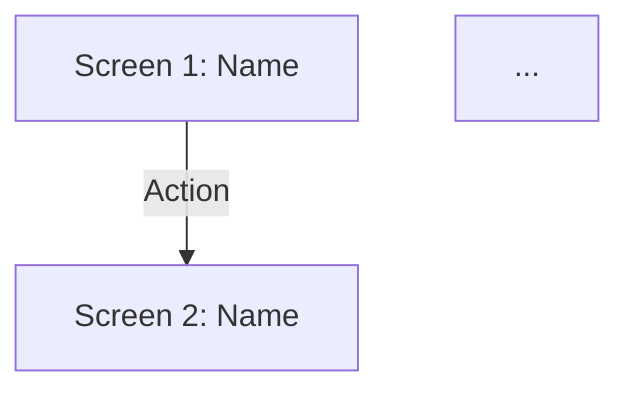

# Prototype Wiring Guide Skill

Generate and wire a clickable Figma prototype by programmatically creating interactions via `setReactionsAsync()`. Maps every interactive element to its target screen and applies transitions. Also produces a wiring guide document for reference.

**Technical approach:** The Figma Plugin API exposes `node.setReactionsAsync(reactions)` which can create "On tap -> Navigate to frame" interactions, overlay triggers, back navigation, and transitions (Push, Slide, Dissolve, Smart Animate). This skill uses `use_figma` MCP calls to wire all interactions programmatically.

## MANDATORY PREPARATION

Read these files before proceeding:
1. `docs/Design/figma-design-plan.md` — screen inventory with node IDs, overlay patterns, construction specs
<!-- CUSTOMIZE: Add your project's PRD or user story file for navigation flows -->
2. Your PRD or user stories file — user story navigation flows (Given/When/Then acceptance criteria)
<!-- CUSTOMIZE: Add your design document reference for animation/transition specs -->
3. Your design document — animation/transition specs

---

## Step 1: Determine Scope

Parse the user's argument to determine which screens to include:
- `all` — all screens (default if no argument)
- `batch 1` / `batch 2` / `batch 3` — screens in that batch only
- `screen 1-7` or `screen 4` — specific screen range or single screen

## Step 2: Build Screen Registry

From the screen inventory table in `figma-design-plan.md`, extract:
- Screen number and name
- Figma frame node ID
- Screen type: full screen, overlay (Pattern A/B/C), or component

Build a lookup table: `{ screenNumber -> { name, nodeId, type } }`

## Step 3: Map Interactions

For each screen in scope, read its construction spec and identify every interactive element. Map each to its navigation target using PRD user stories.

### Interaction types to identify:

| Element | Trigger | Example |
|---------|---------|---------|
| Primary CTA button | On tap | "Continue" -> next screen |
| Secondary button | On tap | "Sign in with email" -> alternate flow |
| Back/close button | On tap | "< Back" -> previous screen |
| BottomNav tabs | On tap | Tab -> target screen |
| FAB (+) button | On tap | -> Create overlay (slide up) |
| Card element | On tap | -> Detail screen (push right) |
| Settings row | On tap | "Members >" -> target list |
| Avatar/profile tap | On tap | -> Profile or filter |
| Overlay backdrop | On tap | -> Dismiss overlay |
| Sheet handle | On drag down | -> Dismiss sheet |
| Text links | On tap | "Forgot password?" -> target |
| Dismiss/close icon | On tap | -> Close overlay/screen |

### Transition types:

<!-- CUSTOMIZE: Adjust durations and easings to match your design document specs -->

| Navigation | Transition | Duration | Easing |
|-----------|-----------|----------|--------|
| Forward (screen -> screen) | Push right | 300ms | ease-in-out |
| Back (return to previous) | Push left | 300ms | ease-in-out |
| Open overlay/sheet | Slide up | 250ms | ease-out |
| Dismiss overlay/sheet | Slide down | 200ms | ease-in |
| Open modal (dialog) | Fade in | 200ms | ease-out |
| Dismiss modal | Fade out | 150ms | ease-in |
| Tab switch (BottomNav) | Instant | 0ms | -- |
| Toast appear | Slide up | 200ms | ease-out |
| Toast dismiss | Fade out | 150ms | ease-in |

## Step 4: Generate Output

### 4a. Prototype Wiring Guide

Write to `docs/Design/prototype-wiring-guide.md`:

```markdown
# Prototype Wiring Guide

> Generated: [date]
> Figma file: <!-- CUSTOMIZE: your Figma file ID -->
> Total interactions: [count]
> Estimated manual wiring time: [N] minutes

## How to Use

1. Open the Figma file in the browser or desktop app
2. Switch to the **Prototype** tab in the right panel
3. For each row below:
   - Select the **source element** (use the node ID to find it in the layers panel)
   - Drag the blue prototype handle to the **target frame**
   - Set the **trigger** and **transition** as specified
4. Set the **starting frame** to your first screen

## Wiring Table

| # | Screen | Element | Trigger | Target Screen | Target Node | Transition |
|---|--------|---------|---------|---------------|-------------|------------|
| 1 | ... | ... | ... | ... | ... | ... |
```

### 4b. Mermaid Flow Diagram

Include inline in the wiring guide:



Group by flow (adapt to your app's navigation structure):
<!-- CUSTOMIZE: Replace these flow groups with your app's navigation architecture -->
- **Onboarding flow:** First-run screens
- **Core loop:** Primary user journey
- **Settings flow:** Configuration screens
- **Secondary flows:** Search, filters, modals

### 4c. Summary

Report at the end:
- Total screens covered
- Total interactions mapped
- Screens with most connections (navigation hubs)
- Any screens with zero outbound interactions (dead ends to flag)
- Estimated wiring time (~30 seconds per interaction)

## Step 5: Validate

Before presenting the guide:
1. Every screen must have at least one interaction (inbound or outbound)
2. Every "Back" button must have a return target
3. Every overlay must have a dismiss action
4. Every BottomNav instance must wire to all tab targets
5. Cross-check against PRD: every user story navigation path must be represented

---

## IMPORTANT RULES

- **Node IDs are required.** Every source element and target frame must include the Figma node ID from the screen inventory. The user needs these to find elements in the layers panel.
- **Don't guess transitions.** Use your design document's animation specs. If no spec exists for a transition, use the defaults from the table above.
- **Overlay vs Navigate.** Overlay screens (Pattern A/B/C) use "Open overlay" action type in Figma, not "Navigate to." This affects how the prototype behaves (overlays stack, navigations replace).
- **One guide per invocation.** Don't split across multiple files.
- **Idempotent.** Running the skill again overwrites the previous guide with an updated version.
